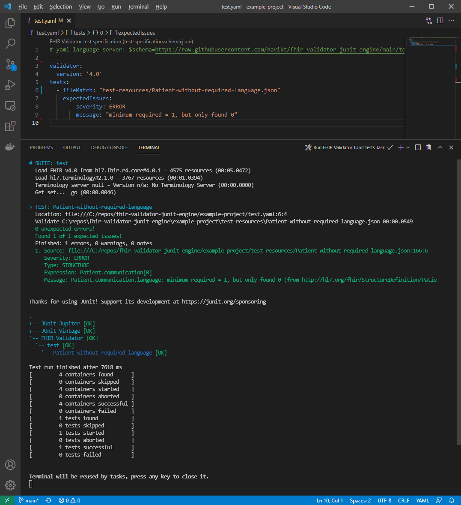

# FHIR Validator JUnit Engine

A [JUnit5 TestEngine](https://software-matters.net/posts/custom-test-engine/) to integrate the FHIR Validator into the JUnit5 ecosystem.

The engine can be used with any JUnit5 test-runner that supports Directory and/or File based [DiscoverySelectors](https://junit.org/junit5/docs/5.8.1/api/org.junit.platform.engine/org/junit/platform/engine/DiscoverySelector.html), e.g. the [JUnit Console Launcher](https://junit.org/junit5/docs/current/user-guide/#running-tests-console-launcher)


## HOWTO
1. The FHIR Validator must be in the Classpath. Download the latest release of [validator_cli.jar](https://github.com/hapifhir/org.hl7.fhir.core/releases/latest/download/validator_cli.jar) or [publisher.jar](https://github.com/HL7/fhir-ig-publisher/releases/latest/download/publisher.jar).
2. Download latest release of the [JUnit Console Launcher](https://repo1.maven.org/maven2/org/junit/platform/junit-platform-console-standalone/1.8.1/junit-platform-console-standalone-1.8.1.jar).
3. Download latest release of [this test engine](https://github.com/navikt/fhir-validator-junit-engine/releases).

Execute the following in a terminal:
```
java -jar junit-platform-console-standalone-1.8.1.jar -cp fhir-validator-junit-engine-0.1.0.jar:validator_cli.jar -f test.yaml
```

See [example-project](example-project) for a working example.


