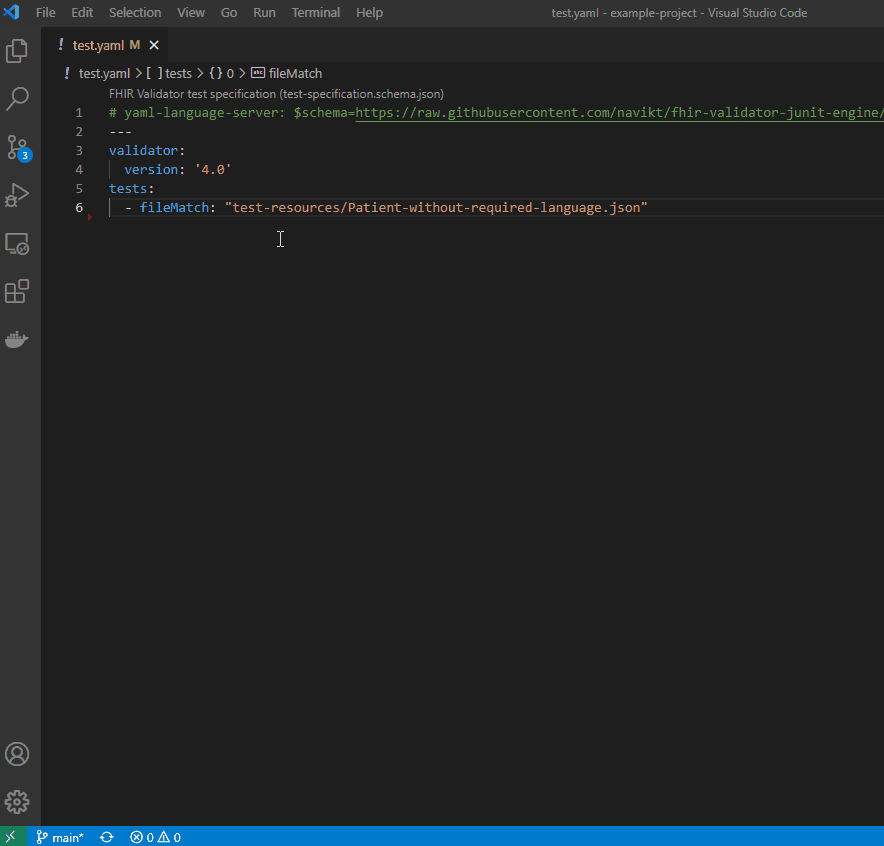

# 🔥 FHIR Validator JUnit Engine

A [JUnit5 TestEngine](https://software-matters.net/posts/custom-test-engine/) to integrate the FHIR Validator into the JUnit5 ecosystem.

Supports writing expected validation outcome as tests in json or yaml files.

The engine can be used with any JUnit5 test-runner that supports file based [DiscoverySelectors](https://junit.org/junit5/docs/5.8.1/api/org.junit.platform.engine/org/junit/platform/engine/DiscoverySelector.html), e.g. the [JUnit Console Launcher](https://junit.org/junit5/docs/current/user-guide/#running-tests-console-launcher)


## 📝 HOWTO
1. The FHIR Validator must be in the Classpath. Download the latest release of [validator_cli.jar](https://github.com/hapifhir/org.hl7.fhir.core/releases/latest/download/validator_cli.jar) or [publisher.jar](https://github.com/HL7/fhir-ig-publisher/releases/latest/download/publisher.jar).
2. Download latest release of the [junit-platform-console-standalone](https://repo1.maven.org/maven2/org/junit/platform/junit-platform-console-standalone/1.8.1/junit-platform-console-standalone-1.8.1.jar).
3. Download latest release of [fhir-validator-junit-engine.jar](https://github.com/navikt/fhir-validator-junit-engine/releases/latest/download/fhir-validator-junit-engine.jar).

Execute the following in a terminal:
```
java -jar junit-platform-console-standalone-1.8.1.jar -cp fhir-validator-junit-engine.jar:validator_cli.jar -f test.yaml
```

This process can be automated, e.g. using `npm`, see [example-project](example-project) for a working example.



## 👨‍💻 Writing tests
Tests are written using specification files in either YAML or JSON. There is a [json-schema](test-specification.schema.json) that can be used to get intellisense and documentation when writing tests in a supported text-editor. Visual Studio Code supports this for json files, but requires an [extension for yaml support](https://marketplace.visualstudio.com/items?itemName=redhat.vscode-yaml).

Following is an example in YAML, most fields are optional but included here for completeness.

```yaml
title: Human readable name of the Test Suite.
validator:
  version: "4.0"
  ig:
    - ../fsh-generated/resources
    - hl7.fhir.us.core#1.0.1
  tx: http://tx.fhir.org
  txLog: logs/tx.txt
  sct: us
tests:
  # 1. Test will validate 1 resource against a profile and expects 1 error and 1 warning.
  - title: Messages with missing destination.endpoint shall give ERROR.
    profile: http://example.com/fhir/StructureDefinition/MyMessage
    fileMatch: test-resources/message-with-missing-destination.json
    tags:
      - fast
      - message
    expectedIssues:
      - severity: WARNING
      - severity: ERROR
        type: INVARIANT
        expression: Bundle.entry[0].resource.ofType(MessageHeader).destination[0].endpoint
        message: minimum required = 1, but only found 0
  
  # 2. Test has multiple file-matches and will generate multiple tests, non of which expects any errors.
  - fileMatch:
      - ../fsh-generated/resources/**
      - "!../fsh-generated/resources/ImplementationGuide-*"
    tags: ig

```

## 🖥️ JUnit Console Launcher
Currently the best way to run custom JUnit engines is to use the official [console launcher](https://junit.org/junit5/docs/current/user-guide/#running-tests-console-launcher). 

- Test files are selected using one or multiple `-f, --select-file` arguments, the values adhere to the [.gitignore variant of the glob pattern](https://git-scm.com/docs/gitignore#_pattern_format).
- Tests can be [filtered by tags](https://junit.org/junit5/docs/current/user-guide/#running-tests-tags), e.g. `--include-tag fast` or `--exclude-tag ig`.
- Tests can be executed in parallel by adding the argument `--config no.nav.execution.parallel.enabled=true`.
- Text coloring in logs can be disabled with `--config no.nav.disable-ansi-colors=true`.

## 🚀 CI\CD
The junit-runner can be configured to output test-reports in JUnit XML format, this can be used in existing tools that already support this format.

The following is an example on how to integrate tests in a GitHub-action workflow. FHIR resources are built using SUSHI and the generated IG is tested using the fhir-validator-junit engine. Because the engine internally uses the official FHIR validator it uses the same package-cache as other FHIR tools (validator, publisher, sushi).

```yaml
on:
  pull_request:
    branches:
      - main
jobs:
  test:
    runs-on: ubuntu-latest
    steps:
      - uses: actions/checkout@v2

      - name: 🗂️ Cache FHIR Packages
        uses: actions/cache@v2
        with:
          path: |
            ~/.fhir/packages
          key: fhir-packages

      - name: 🍣 Run SUSHI
        run: |
          npm install -g fsh-sushi
          sushi /ig

      - name: 📥 Download test tools
        run: |
          wget -q https://github.com/navikt/fhir-validator-junit-engine/releases/latest/download/fhir-validator-junit-engine.jar
          wget -q https://github.com/hapifhir/org.hl7.fhir.core/releases/latest/download/validator_cli.jar
          wget -q https://repo1.maven.org/maven2/org/junit/platform/junit-platform-console-standalone/1.8.1/junit-platform-console-standalone-1.8.1.jar
          
      - name: ✔️ Run tests
        run: java -jar junit-platform-console-standalone-1.8.1.jar -cp fhir-validator-junit-engine.jar:validator_cli.jar -f /tests/*.yaml --reports-dir /test-results
        continue-on-error: true

      - name: 📤 Publish test results
        uses: EnricoMi/publish-unit-test-result-action@v1
        with:
          commit: ${{ github.event.workflow_run.head_sha }}
          files: "/test-results/TEST-*.xml"
```


